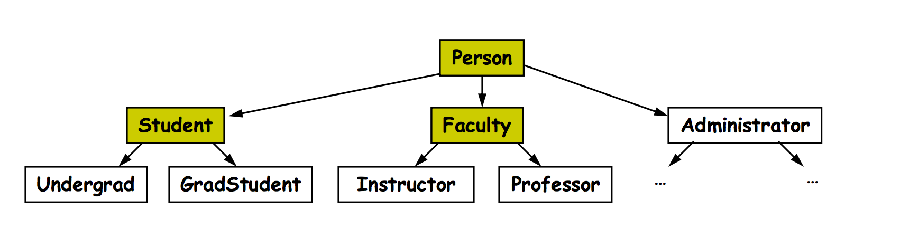

### Enumeration

```java
public enum Day { //Constructor is private
    MON, TUE, WED, THU, FRI;
}

Day x = Day.WED;
if(x == Day.THU) {} // Can compare using ==
if(x.compareTo(Day.WED) < 0) {} // For enum, compareTo checks the order 


for(Day d: Day.values()) {
    System.out.println(d + getWorkHours(d));
}
```

The only thing you can't do with enums is make a public constructor. 

```java
public enum Day {
    
    SUN("Sunday", 0), MON("Monday", 8), 
    TUE("Tuesday", 6), WED("Wednesday", 8), 
    THU("Thursday", 6), FRI("Friday", 8), 
    SAT("Saturday", 0);
    
    private String name;
    private int workHours;
    
    // Note: Constructors must be private!
    private Day(String name, int workHours) {
        this.name = name;
        this.workHours = workHours;
    }
    
    public String getName() {
        return name;
    }
    
    public int getWorkHours() {
        return workHours;
    }
}
```

Enums are mutable. All instances change if changed. 

---

### Iterator 

Interface: 
```java
interface Iterator {
    boolean hasNext();
    Object next(); // returns reference to the element, moves marker to next position. 
    Object remove();
}
```

Example: 
```java
ArrayList<String> = new ArrayList<String>();
Interator<String> it = list.Iterator();
while(it.hasNext()) {
    String curr = it.next();
    if(curr.length() < 4) {
        it.remove();
    }
}
```

If you call `remove` when next hasn't been called,  or remove has been called after the last call to next, then an  `IllegalStateException` is thrown. 

A foreach loop uses an Iterator under the hood, but does not allow a remove. If you try to modify a collection while using a foreach, a `ConcurrentModificationException` will be thrown. 

```java
interface Iterable {
    Iterator iterator();
}
```

The `Iterable` interface shows that a class can be iterated over. 

---

### Java Equals Method

An equal methods should be written like this:
```java
public class Dog {
    ...
    public boolean equals(Object other) {
        if(this == other) return true; // Check if pointing to the same object
        if(!(other instanceof Dog)) return false;
        Dog dog = (Dog)other;
        return (dog.name.equals(name)) && dog.size == size;
    }
}
```

---

### Comparable Interface

Lets you do `a.compareTo(b)`

```java
public class Dog implements Comparable<Dog> {
    public int compareTo(Dog other) {
        return size - other.size;
    }
}
```

Also lets you sort

```java
ArrayList<Dog> dogs = new ArrayList<Dog>();
Collections.sort(dogs);
```

---

### Annotations

```java
@Test // specifies a method as a JUnit test. 
@Override // makes compiler check if method is valid override. 
@Deprecated // lets people know a method is deprecated
```

---

### Inheritence 

Uses the keyword `extend`

```java
public class Dog extends Animal {}

void foo(Dog x) { // takes a Dog or any Dog subclass. 
    x.bark();
}
```

You cannot cast down, only up. Casting down causes an `IllegalCastException`

A class can implement as many interfaces as needed, but can only extend one class. 

Example:

 

---

Difference betwen `implements` and `extends`: 

`implements`:
- keyword followed by the name of an interface
- interfaces only have method prototypes
- you cannot create on object of an interface type

`extends`:
- keyword followed by the name of a base class
- base class contains method implementations
- allows inheritance
- you can create objects of that base class type

---

### Copy Constructor

```java
public Person(Person other) {
    this.name = other.name;
    this.idNumber = other.idNumber;
}
```

---

### Memory 

Heap:

```java

new Person(...)
new Student(...) //Person <-- Student (Student is-a Person)


Student            Person
+------------+     +-------------+
| Name       |     | Name        |
+------------+     +-------------+
| ID         |     | ID          |
+---+----+---+     +-------------+
    |    |
    |    | <-- super
    +----+ <-- this 
```

`this`: current object
`super`: current object, but in the context of it's super class. 

```java

Person sashank = new Student();

        Stack                Heap
        +---------+         +-------------+
        |         |         |             |
        |         |   +---> +-------------+
        |         |   |     |             |
        |         |   |     +----+----+---+
        |         |   |          |    |
        |         |   |          |    |
        |         |   |          +----+
        +---------+   |
        |         |   |
sashank |     +-------+
        |         |
        +---------+

```

---

### Example Parent Class

```java
public class Person {

    private String name;
    private int ID;

    public Person(String name, int ID){
        this.name = name;
        this.ID = ID;
    }
    
    public Person(Person other) { // Copy Constructor
        name = other.name;
        ID = other.ID;
    }
    
    public String getName() {
        return name;
    } 
    
    public int getID() {
        return ID;
    }
    
    public void setName(String name) {
        this.name = name;
    }
    
    public void setID(int ID) {
        this.ID = ID;
    }
    
    public String toString() {
        return "Name: " + name + ", ID: " + ID;
    }
    
    public boolean equals(Object other) {
        if (this == other) {
            return true;
        }
        if ( !(other instanceof Person)) {
            return false;
        }
        Person person = (Person)other;
        return person.name.equals(name) && person.ID == ID;
    }
}
```

---

### Example Student Class

```java
public class Student extends Person{

    private double GPA;
    private int admitYear;
    
    public Student(String name, int ID, double GPA, int admitYear) {
        super(name, ID);
        this.GPA = GPA;
        this.admitYear = admitYear;
    }
    
    public Student() {
        super("Unknown", 0);
        GPA = 0.0;
        admitYear = 0;
    }
    
    public Student(Student other) {
        super(other);
        GPA = other.GPA;
        admitYear = other.admitYear;
    }
    
    public String toString() {
        return super.toString() + ", GPA: " + GPA + ", admitted: " + admitYear;
    }
    
    public boolean equals(Object other) {
        if (this == other) {
            return true;
        }
        if ( !(other instanceof Student)) {
            return false;
        }
        Student s = (Student) other;
        return super.equals(s) && s.GPA == GPA && s.admitYear == admitYear;
    }

    public boolean equals(Object other) {
        if(this == other) {
            return true;
        }
        if(! (other instanceOf Student)) {
            return false;
        }
        Student s = (Student) other;
        return super.equals(s) && this.GPA == s.GPA && this.admitYear == s.admitYear;
    }
}
```

----

### Extending Classes

If a class extends another class, the first thing that happens is the parent constructor is run. 

Every class implicitly extends the `Object` class. 

---

### Overriding vs Overloading

**Overriding** : A derived class defines a method with the same name and parameters as the base class. 

**Overloading** : Two or more methods have the same name, but different parameters. 

---

### Early vs. Late Binding

Consider: 
```java
Person p = new Student();
System.out.println(p.toString());
```

Would it use the Person's `toString` or Students `toString`?

**Early Binding** : 
- Compiler binds it to what the variable is defined as (Person)

**Late Binding** : 
- First does sanity check during compilation. Makes sure Person has a toString, but it doesn't bind it yet. 
- At runtime, looks at type (on heap) and uses that type. 

Java uses Early Binding. 
C++ uses Late Binding. 

---

### Visibility

public :        class, package, subclass, world
protected :     class, package, subclass
package :       class, package
private :       class

---


